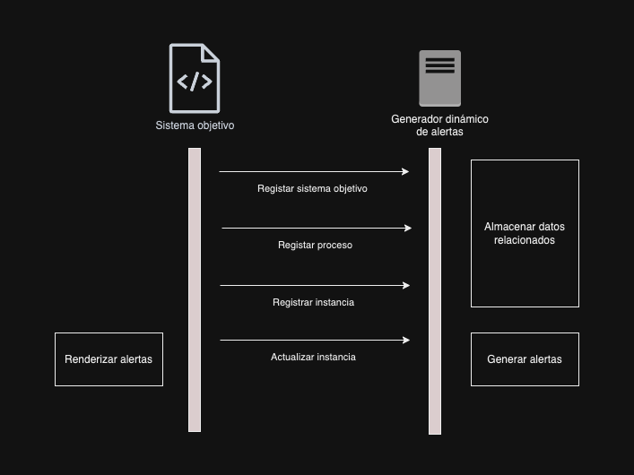

# Generador dinámico de alertas

Su función principal es la generación dinámica de alertas de usuario, basándose en la interpretación de procesos de negocio en el estándar BPMN de acuerdo patrones de alerta obtenidos mediante un proceso de investigación en la que se analizaron las alertas generadas en reconocidas aplicaciones en 18 categorías diferentes. Este software ha sido desarrollado como resultado de la tesis de investigación denominada 'Prototipo de componente software para la generación dinámica de alertas de usuario basada en procesos de negocio', y como su nombre lo indica corresponde a un prototipo o versión inicial, el cual ha diseñado para poder integrarse con otros sistemas software a través de servicios expuestos en un API REST. 
<br><br>
Los sistemas que se integran con este componente se consideran un 'sistema objetivo', los sistemas objetivo podrán darse de alta ante este componente y registrar procesos de negocio (en el estándar BPMN), registrar instancias de ejecución de los procesos registrados en el componente y actualizar los estados de dichas instancias dentro del proceso al que pertenecen, cada actualización generará las alertas de usuario de acuerdo a las definiciones de la investigación anteriormente mencionada.
<br><br>
Este componente ha sido construido con las tecnologías PHP como lenguaje de programación, Laravel/Lumen como framework de back-end, Mysql como motor de base de datos, Docker como herramienta de virtualización y Composer como manejador de dependencias. 
<br><br>

# Requisitos de instalación
Es requerido tener instaladas las herramientas Docker y Docker-compose en el ambiente en donde se desplegará el componente y que dicho ambiente cuente con el puerto 8083 disponible para su uso.
<br><br>

# Instalación
Luego de clonar el repositorio, es necesario inicializar los contenedores que soportan la lógica del componente. Usando una consola ubicada en la carpeta contenedora, ejecutar los siguientes comandos para la construcción de los contenedores:

```sh
docker-compose build
docker-compose up -d
```

Esto generará los dos contenedores del componente, uno para el manejo del API REST y otro para la gestión de base de datos llamados 'component-api-container' y 'component-database-container'.
<br><br>
De manera estándar el componente se despliega en el puerto 8083, sin embargo, en caso de que este puerto no se encuentre disponible para su uso, se deberá modificar la entrada `ports` del archivo `docker-compose.yaml` mapeando el puerto disponible en el ambiente (sólo se debe modificar el puerto externo, el puerto interno debe mantenerse como 8083)
<br><br>
Antes de continuar es necesario realizar la inicialización de depdencias y de la base de datos, como primer paso y utilizando una consola se debe ingresar al contenedor del api mediante el siguiente comando:
```sh
docker exec -it component-api-container /bin/bash
```
Una vez dentro de la consola del contenedor, ejecutar los siguientes comandos para la instalación de dependencias:
```sh
cd /app/user-alerts-component/
composer install
```
Para la inicialización de la base de datos, se deben ejecutar las migraciones de base de datos mediante el siguiente comando:
```sh
cd /app/user-alerts-component/
php artisan migrate
```
Una vez ejecutados estos comandos, el componente estará listo para la escucha de peticiones a través del API REST en el puerto exteno configurado para tal fin.
<br><br>

# Integración con otros sistemas
Para que un sistema objetivo pueda integrarse con el componente, deberá implementar la comunicación mediante los métodos del API REST para el registro de versiones del proceso, instancias asociadas y actualización de instancias asociadas. En cada actualización de instancias se podrán retornar sugerencias de alertas de usuario con la información inherente en formato JSON con los atributos asociados, estos atributos podrán ser renderizados por el sistema objetivo para mostrarlos en su interfaz de vuelta al usuario.


<br><br>

# Métodos del API REST

**<font color='#d9714c'>POST</font>** /targetsystem
<br>
Registra un sistema objetivo en el componente y retorna un token para su uso en los demás endpoints.

**Entradas:**
- `name`: Nombre del sistema a registrar.
<br><br>

**Retorno:**
- `target_system_token`: Identificador del sistema objetivo
- `created_at`: Fecha de creación del sistema objetivo
<br><br>

**<font color='#1e9441'>GET</font>**/targetsystem
<br>
Obtiene la información asociada a un sistema objetivo registrado en el componente.

**Entradas:**
  - `target_system_token`: Token del sistema objetivo.
<br><br>

**Retorno:**
- `name`: Nombre del sistema objetivo
- `target_system_token`: Identificador del sistema objetivo
- `created_at`: Fecha de creación del sistema objetivo
- `processes`: Datos de los procesos asociados al sistema objetivo
<br><br>

**<font color='#d9714c'>POST</font>** /process
<br>
Registra un proceso de negocio en un sistema objetivo.

**Entradas:**
  - `process_name`: Nombre del proceso, array con las claves
    - `subject`
    - `verb`
    - `complement`
  - `target_system_token`: Token del sistema al que se registrará el proceso.
  - `process_token`: Token del proceso (si corresponde a una versión actualizada).
  - `risky_execution`: Valor 0 o 1 para marcar el proceso como de ejecución riesgosa.
  - `idempotent_execution`: Valor 0 o 1 para marcar el proceso como de ejecución idempotente.
  - `process_bpmn`: Archivo BPMN que representa el proceso.
<br><br>

**Retorno:**
- `process_token`: Identificador del proceso creado
- `process_name`: Nombre del proceso creado
- `created_at`: Fecha de creación del proceso
<br><br>

**<font color='#1e9441'>GET</font>**/process
<br>
Obtiene los datos relacionados a un proceso en un sistema objetivo.

**Entradas:**
  - `target_system_token`: Token del sistema.
  - `process_token`: Token del proceso.
<br><br>

**Retorno:**
- `name`: Nombre del proceso
- `target_system`: Nombre del sistema objetivo relacionado al proceso
- `process_token`: Identificador del proceso
- `version`: Versión del proceso
- `created_at`: Fecha de creación del proceso
- `elements`: Descripción de elementos del proceso
- `user_roles`: Roles del proceso
<br><br>

**<font color='#d9714c'>POST</font>** /instance
<br>
Registra una instancia de ejecución para un proceso específico.

**Entradas:**
  - `target_system_token`: Token del sistema.
  - `process_token`: Token del proceso.
<br><br>

**Retorno:**
- `process_instance_token`: Identificador de la instancia
- `created_at`: Fecha de creación de la instancia
<br><br>

**<font color='#1e9441'>GET</font>**/instance
<br>
Obtiene los datos de una instancia de proceso.

**Entradas:**
  - `target_system_token`: Token del sistema.
  - `process_instance_token`: Token de la instancia.
<br><br>

**Retorno:**
- `process_token`: Nombre del proceso relacionado a la instancia
- `process_instance_token`: Identificador de la instancia
- `created_at`: Fecha de creación de la instancia
- `current_status`: Información del estado actual de la instancia en el proceso
- `instance_history`: Historial de la instancia
<br><br>

**<font color='#275eb8'>PUT</font>** /instance
<br>
Actualiza el estado de una instancia de proceso.

**Entradas:**
  - `target_system_token`: Token del sistema.
  - `process_instance_token`: Token de la instancia.
  - `next_element_id`: Identificador del siguiente elemento dentro del proceso.
  - `force_generate`: Valor 0 o 1 para forzar la generación de alertas.

**Retorno:**
- `process_token`: Nombre del proceso relacionado a la instancia
- `process_instance_token`: Identificador de la instancia
- `created_at`: Fecha de creación de la instancia
- `current_status`: Información del estado actual de la instancia en el proceso
- `instance_history`: Historial de la instancia
- `suggested_alerts`: Alertas de usuario sugeridas
    - `process_instance_history_id`: Identificador del elemento de historial al que está asociada la alerta
    - `type`: Tipo de alerta de usuario (error, warning, success, feedforward)
    - `visual_representation`: Representación visual sugerida (message-box, simple-word)
    - `color`: Color sugerido para la alerta (red, yellow, blue, green, orange)
    - `message`: Mensaje sugerido para la alerta
    - `icon`: Icono sugerido para la alerta (font awesome)
    - `title`: Título sugerido para la alerta
    - `alert_moment`: Momento de presentación de alerta (transition-out)
    - `actions`: Acciones contextuales de la alerta
